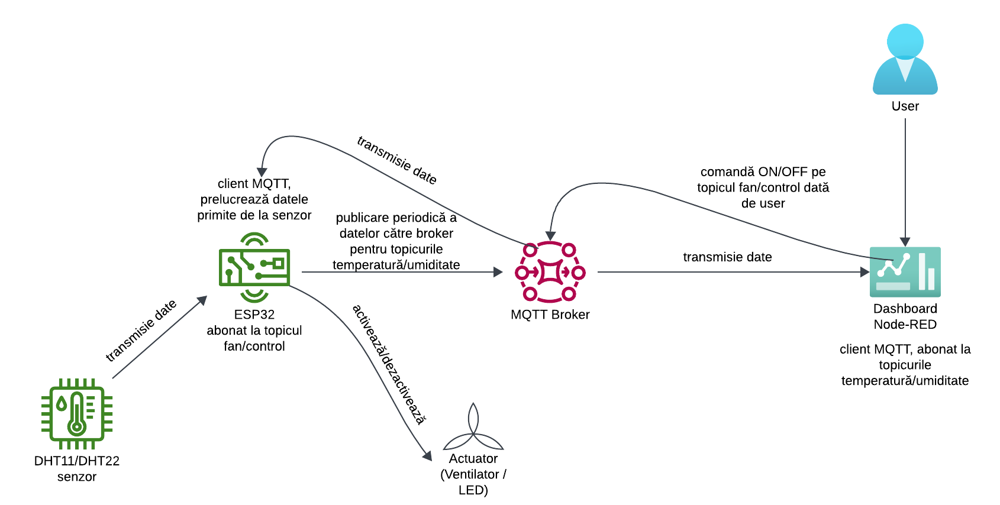
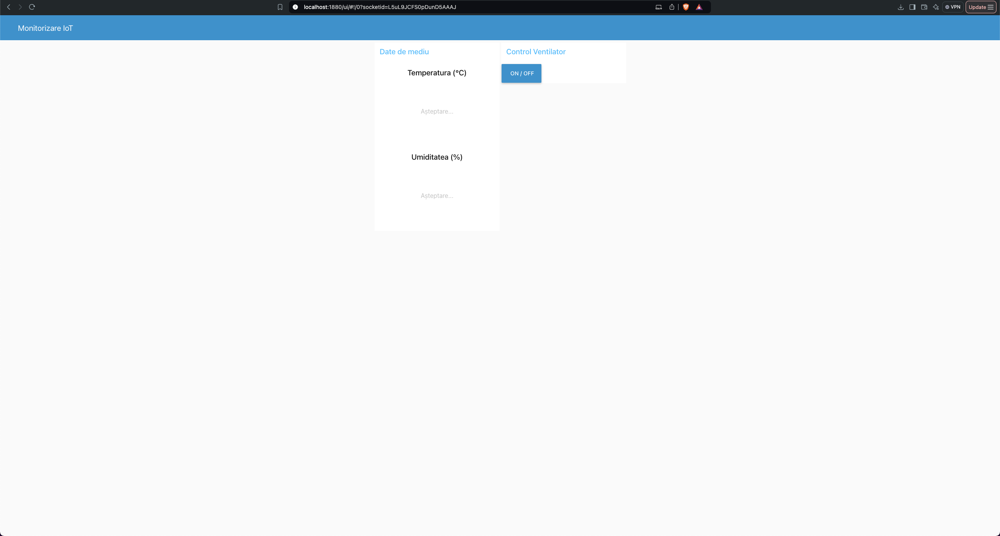

# Raport PRIoT  
## Sistem pentru Monitorizarea Temperaturii și Umidității cu Notificări și Control la Distanță  

Autor: **Dumitrescu Rareș-Matei**  
Data: **10 Decembrie 2024**

---

## Cuprins
- [Raport PRIoT](#raport-priot)
  - [Sistem pentru Monitorizarea Temperaturii și Umidității cu Notificări și Control la Distanță](#sistem-pentru-monitorizarea-temperaturii-și-umidității-cu-notificări-și-control-la-distanță)
  - [Cuprins](#cuprins)
  - [Introducere](#introducere)
    - [Descrierea proiectului](#descrierea-proiectului)
    - [Obiective](#obiective)
  - [Arhitectură](#arhitectură)
    - [Schema topologiei rețelei](#schema-topologiei-rețelei)
    - [Dashboard pentru User](#dashboard-pentru-user)
    - [Protocolul de comunicare](#protocolul-de-comunicare)
  - [Cod sursă](#cod-sursă)
    - [ESP32 - Configurare senzori și transmitere date](#esp32---configurare-senzori-și-transmitere-date)
  - [Vizualizare date](#vizualizare-date)
    - [Node-RED](#node-red)
      - [Noduri folosite:](#noduri-folosite)

---

## Introducere  

### Descrierea proiectului  
Acest proiect IoT permite monitorizarea temperaturii și umidității în timp real folosind senzori **DHT11/DHT22** conectați la un microcontroller **ESP32**. Scopul proiectului este să ofere:  
- Date despre mediu printr-un dashboard web.  
- Alerte în timp real pentru depășirea limitelor.  
- Posibilitatea de a controla un actuator de la distanță.  

### Obiective  
- Monitorizarea temperaturii și umidității în timp real.  
- Vizualizarea datelor pe un dashboard web.  
- Notificarea utilizatorului în caz de depășire a limitelor.  
- Controlul unui ventilator/LED prin aplicație web.

---

## Arhitectură  

### Schema topologiei rețelei  
  
**Figura 1**: Schema topologiei rețelei  

### Dashboard pentru User  
  
**Figura 2**: Dashboard pentru User  

Sistemul constă din:  
- Un senzor **DHT11/DHT22** conectat la un **ESP32** care transmite date către un broker MQTT.  
- Datele sunt preluate și afișate pe un dashboard web realizat cu Node-RED.  

### Protocolul de comunicare  
Protocolul **MQTT** a fost ales pentru transmisia eficientă a datelor, datorită:  
- Consumul redus de resurse.  
- Scalabilității.

---

## Cod sursă  

### ESP32 - Configurare senzori și transmitere date  

```cpp
#include <WiFi.h>
#include <PubSubClient.h>
#include <DHT.h>

// senzor
#define DHTPIN 5
#define DHTTYPE DHT11
DHT dht(DHTPIN, DHTTYPE);

// WiFi si MQTT
const char* ssid = "Numele_WiFi";
const char* password = "Parola_WiFi";
const char* mqtt_server = "broker.hivemq.com";
WiFiClient espClient;
PubSubClient client(espClient);

void setup() {
  Serial.begin(115200);
  dht.begin();
  WiFi.begin(ssid, password);
  client.setServer(mqtt_server, 1883);
}

void loop() {
  if (!client.connected()) reconnect();
  client.loop();
  float temp = dht.readTemperature();
  float hum = dht.readHumidity();
  if (!isnan(temp) && !isnan(hum)) {
    client.publish("temperature", String(temp).c_str());
    client.publish("humidity", String(hum).c_str());
  }
  delay(2000);
}
```
## Vizualizare date

### Node-RED
Dashboard-ul este configurat pentru a afișa temperatura și umiditatea în timp real și pentru a trimite notificări atunci când valorile depășesc limitele predefinite.

#### Noduri folosite:
- **MQTT In** - pentru datele de la senzori.
- **Chart** - pentru graficele temperaturii și umidității.
- **Notification** - pentru alerte.
